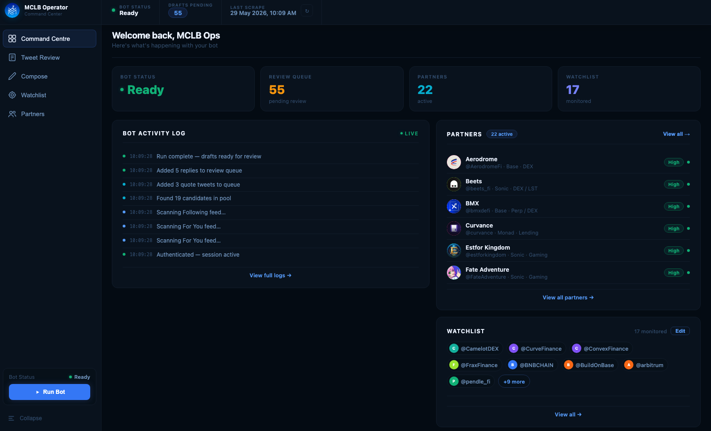
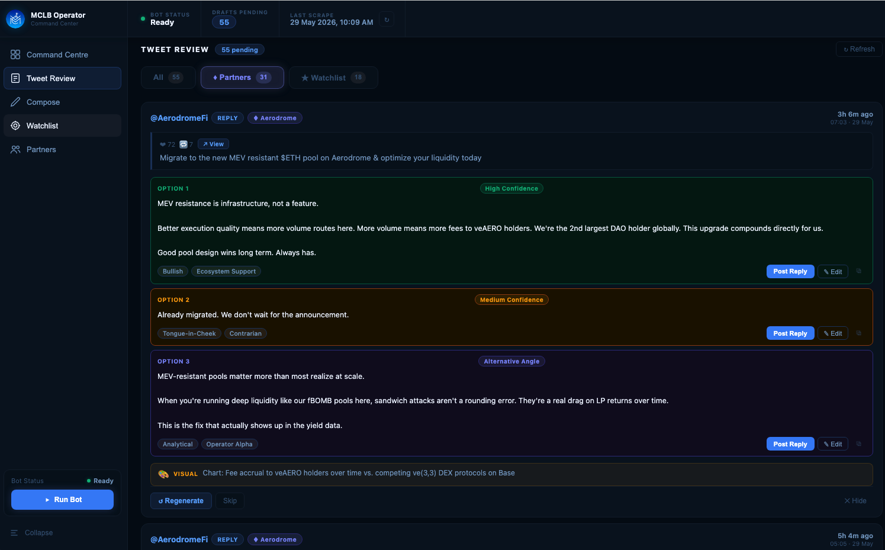
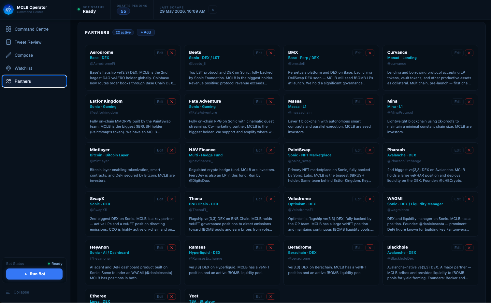

# DeFi Operator Bot

> **Consistent presence across every protocol you touch.**

An AI-powered Twitter engagement command centre for DeFi DAOs and protocol operators. Monitors partner accounts across chains and timelines, drafts context-aware replies and quote-tweets using Claude, and surfaces every opportunity through a local review dashboard for one-click human-approved posting.

This repo is the MCLB DAO instance, configured for 22 active partner protocols across 8+ chains.

Built by [@CatDad0x](https://x.com/CatDad0x)

---

## Why This Exists

In DeFi, Twitter presence is operational infrastructure. DAOs with active governance positions, liquidity deployments, and protocol partnerships are expected to show up -- congratulating launches, engaging with epoch announcements, amplifying partner milestones, and keeping the DAO's name visible in the right conversations at the right time.

The problem is scale. MCLB has active positions across 22 protocols on 8+ chains. Manually monitoring every partner account, identifying which tweets deserve engagement, drafting a reply that actually sounds like it comes from someone who understands the protocol, and doing all of this consistently every day -- it is not realistic for one operator.

The alternative is silence or generic replies, both of which are worse than not engaging at all.

This bot solves the operational problem without removing human judgment from the output. The AI does the monitoring and drafting. The operator makes every final call on what actually gets posted.

---

## Command Centre



The main dashboard shows live bot status, the number of drafts pending review, active partner count, watchlist size, and a real-time activity log of what happened on the last run. Everything is visible at a glance before touching any individual draft.

---

## How It Works

### 1. Authentication

The bot authenticates to Twitter using real browser cookies exported from a logged-in Chrome session. Playwright launches a headless Chromium instance and injects these cookies before any navigation, giving it the same access as a logged-in user without using the official API.

This approach avoids the rate limits and permission restrictions of the Twitter v2 API and allows the bot to access timeline content, profile tweets, and engagement metrics in exactly the same way a human would see them.

### 2. Tweet Discovery

On each run, the bot collects candidate tweets from two sources:

**Direct partner profile scraping**

Every active partner account is visited directly at `x.com/{handle}`. The bot waits for React to fully render the tweet feed using `wait_for_selector("article[data-testid='tweet']")` rather than firing on `domcontentloaded`, which would read a blank or stale page on a JavaScript-heavy SPA like Twitter.

Partners are shuffled into a random order on each run to avoid always hitting the same accounts first when rate limits kick in. A 700ms delay is inserted between each profile visit.

**Timeline scraping**

The Following and For You feeds are also scraped. Tweets from accounts in the partner registry are extracted here as well, catching content that did not appear during direct profile visits.

Partner tweets bypass the relevance keyword filter entirely. A tweet like "Epoch 142 voting is live" contains no DeFi keywords, but it is always relevant if it comes from a partner account. Non-partner tweets are filtered by a keyword list before entering the candidate pool.

### 3. Deduplication

Every tweet that gets processed is recorded in `seen_posts.json` by tweet ID. On the next run, any tweet already in that file is skipped before any AI call is made.

A tweet is only added to `seen_posts.json` if a draft was successfully saved. If Claude fails, returns an error, or produces output that cannot be parsed, the tweet stays out of the seen set and will be retried on the next run. This prevents tweets from being permanently blacklisted without ever producing a usable draft.

Tweet age is also checked using the Twitter snowflake ID timestamp (`ms = (int(tweet_id) >> 22) + 1288834974657`). Tweets older than the configured age limit are skipped without an AI call.

### 4. AI Drafting

Each candidate tweet is sent to Claude with a structured prompt containing:

- The full text of the original tweet
- The partner's name, chain, and protocol category
- A detailed context profile describing MCLB's relationship with the protocol (governance position, LP deployments, investment status, key team contacts)
- Whether the response should be a reply or a quote-tweet
- Instructions on tone, length, and what to avoid

Claude returns three variants per tweet. Each variant is tagged with a tone label (Bullish, Analytical, Tongue-in-Cheek, Operator Alpha, etc.) and a confidence rating (High, Medium, Alternative Angle). It also suggests a visual asset when one would add value to a quote-tweet.

The context profile is what separates these drafts from generic AI replies. A response to an Aerodrome epoch announcement that references MCLB's position as the 2nd largest DAO veAERO holder globally reads completely differently from one that does not have that context.

### 5. Review Dashboard

All drafts are saved to `drafts.json` and surfaced in the local Flask dashboard. No draft is posted without a human reviewing it first.

---

## Tweet Review



Each captured tweet shows the original content, engagement counts, and all three AI-drafted response options. The operator can:

- **Post Reply** or **Post Quote-Tweet** directly from any option
- **Edit** a draft inline before posting
- **Regenerate** to get three fresh variants from Claude
- **Skip** to soft-dismiss the tweet (it stays in the log)
- **Hide** to permanently blacklist the tweet so the bot never re-drafts it

Drafts are separated into tabs: All, Partners, and Watchlist.

---

## Partner Registry



Every partner protocol has a full profile card showing chain, category, Twitter handle, and the context description used by Claude when drafting responses. Partners can be added, edited, or deactivated directly from the dashboard without touching any code changes.

---

## Partner Context Profiles

The context profile for each partner is the most important input to the AI drafting step. A minimal entry looks like this:

```json
{
  "handle": "AerodromeFi",
  "name": "Aerodrome",
  "chain": "Base",
  "category": "DEX",
  "active": true,
  "context": "Base's flagship ve(3,3) DEX. MCLB is the 2nd largest DAO veAERO holder globally. Coinbase now routes order books through Base Chain DEXs -- our veAERO stake is direct exposure to the future of American crypto infrastructure. We run continuous fBOMB liquidity pools on Aerodrome. Key figure: @wagmiAlexander (lead)."
}
```

This context is injected into every Claude prompt for tweets from this account. The result is responses that demonstrate genuine knowledge of the protocol relationship rather than surface-level engagement.

---

## Deduplication and State Management

The bot maintains two JSON files that persist across runs:

**`seen_posts.json`** -- a flat list of tweet IDs that have already been processed. Any tweet in this list is skipped at the start of the candidate loop, before any scraping overhead or AI call. Tweets are added to this list only after a draft is successfully written.

**`drafts.json`** -- all generated drafts with their status (pending, posted, skipped, hidden). The dashboard reads this file on load and on each refresh.

Tweets marked as hidden in the dashboard are added to `seen_posts.json` at hide time, permanently preventing the bot from re-drafting them on future runs.

---

## Tech Stack

| Layer | Technology |
|---|---|
| Twitter scraping | Playwright (headless Chromium, cookie auth) |
| AI drafting | Anthropic Claude API |
| Dashboard | Flask + vanilla JS |
| Data storage | JSON flat files |
| Automation | macOS `.command` launchers |

---

## MCLB Partner Ecosystem

This instance monitors 22 active partners across 8+ chains:

| Protocol | Chain | Category | Position |
|---|---|---|---|
| Aerodrome | Base | ve(3,3) DEX | 2nd largest DAO veAERO holder globally |
| Velodrome | Optimism | ve(3,3) DEX | Large veNFT + continuous LPs |
| Beets | Sonic | DEX / LST | Biggest holder, revenue-positive protocol |
| SwapX | Sonic | DEX | Key LP partner + veNFT position |
| Pharaoh | Avalanche | ve(3,3) DEX | Large vePHAR + active LPs |
| Thena | BNB Chain | ve(3,3) DEX | veNFT governance + fBOMB pools |
| Blackhole | Avalanche | ve(3,3) DEX | Bribe + LP partner |
| BMX | Base | Perp / DEX | Governance position |
| Beradrome | Berachain | ve(3,3) DEX | veNFT + fBOMB LPs |
| Ramses | Hyperliquid | ve(3,3) DEX | veNFT + fBOMB LPs |
| Curvance | Monad | Lending | Seed investor |
| PaintSwap | Sonic | NFT Marketplace | Biggest BRUSH holder |
| Estfor Kingdom | Sonic | Gaming | Biggest BRUSH holder |
| Fate Adventure | Sonic | Gaming | Biggest holder |
| WAGMI | Sonic | DEX / Liquidity | Active position |
| HeyAnon | Sonic | AI / Dashboard | Active position |
| Massa | Massa | L1 | Seed investor |
| Mina | Mina | L1 | Investor |
| Mintlayer | Bitcoin | Bitcoin Layer | Investor |
| NAV Finance | Multi | Hedge Fund | LP |
| Etherex | Linea | ve(3,3) DEX | Seed LP |
| Yeet | TBA | Strategy | Largest investor |

---

## Setup

### Prerequisites

- Python 3.10+
- An Anthropic API key
- Twitter account cookies (exported from a logged-in Chrome session)

### Install

```bash
cd mclb-bot
python3 -m venv venv
source venv/bin/activate
pip install -r requirements.txt
playwright install chromium
```

### Configure

Copy `.env.example` to `.env` and add your Anthropic API key:

```bash
cp .env.example .env
```

Export your Twitter cookies from Chrome using a browser extension like Cookie-Editor. Save the exported JSON to `browser_cookies.json` in the project root.

### Run

Start the review dashboard in one terminal:

```bash
python3 dashboard.py
```

Open `http://localhost:5001` in your browser. Then run the bot in a second terminal:

```bash
python3 bot.py
```

Or use the included macOS launchers: `Run Bot.command` and `Start Dashboard.command`.

---

## Adapting for a Different DAO

The bot and dashboard are protocol-agnostic. To run this for a different DAO or operator account:

1. Replace `partner_accounts.json` with your partner list and context profiles
2. Update `target_accounts.json` with your watchlist accounts
3. Point `browser_cookies.json` at your operator Twitter account
4. Update the context descriptions to reflect your DAO's actual positions

No code changes required. The AI drafting quality scales directly with the detail in your context profiles.

---

## Project Structure

```
mclb-bot/
├── bot.py                  # Core bot: scraping, AI drafting, deduplication
├── dashboard.py            # Flask dashboard: review, compose, post
├── partner_accounts.json   # Partner profiles with context for Claude
├── target_accounts.json    # Watchlist accounts to monitor
├── targets.txt             # Additional accounts list
├── requirements.txt
├── .env.example
├── Run Bot.command
└── Start Dashboard.command
```

---

## Notes

- All posts are manually reviewed before publishing. The AI drafts; the human decides.
- `browser_cookies.json`, `.env`, `drafts.json`, and `seen_posts.json` are gitignored and never committed.
- Partner context profiles should be updated as relationships evolve.

---

*Not a posting bot. A drafting and review tool for operators who care about quality.*
